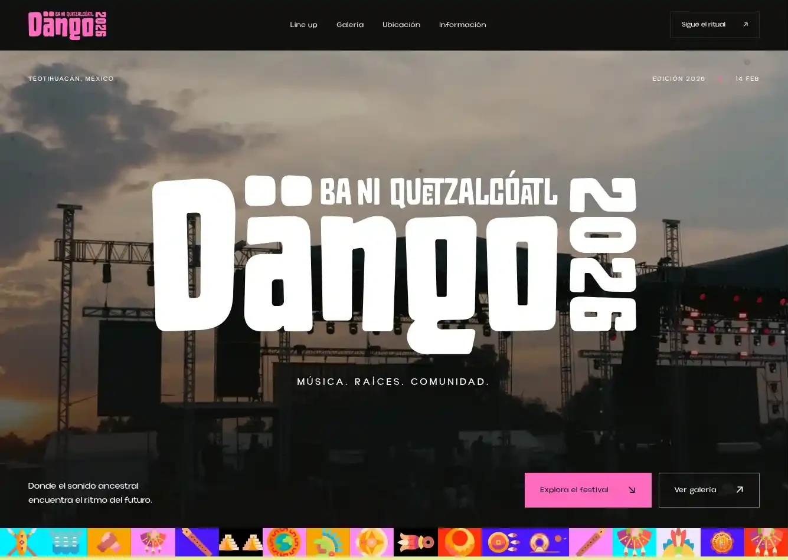
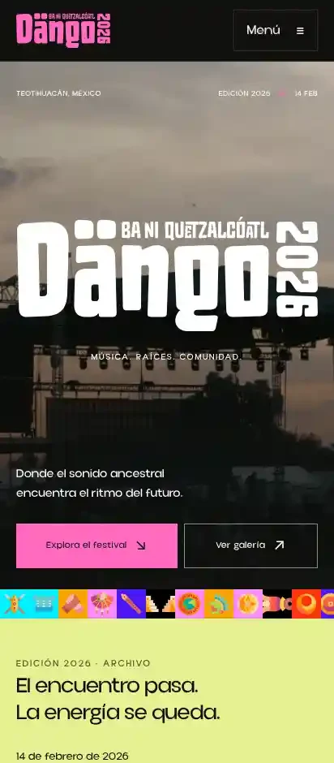

# Auditoría de Festival Dängo — 5 de septiembre de 2026

## Referencia inicial

Repositorio: `eddndev-studio/dango`. Versión inicial: `e5943d09d159c8cca2aec854bc86c669a64d771a`.

Lighthouse 13.4.1, perfil móvil, contra el mismo dominio de producción antes y después:

| Medición                         |     Antes | Publicado |
| -------------------------------- | --------: | --------: |
| Rendimiento                      |        65 |       100 |
| Accesibilidad                    |        92 |       100 |
| Buenas prácticas                 |       100 |       100 |
| SEO automatizado                 |       100 |       100 |
| FCP                              |     3.9 s |     1.0 s |
| LCP                              |     6.2 s |     1.6 s |
| CLS                              |         0 |         0 |
| TBT                              |      0 ms |      0 ms |
| Peso transferido en la auditoría | 1,274 KiB |   307 KiB |

La transferencia inicial se redujo un 76%. El HTML pasó de 268,862 a 39,511 bytes (85% menos) y el JavaScript de aplicación pasó de 153,838 a 2,412 bytes (98% menos; sin comprimir).

En producción, el perfil de escritorio también obtuvo **100/100 en las cuatro categorías**, con LCP de 0.4 s.

El 100 de SEO automatizado no detectaba todas las inconsistencias: `robots.txt` enviaba a otro dominio; el evento en JSON-LD usaba marzo aunque el cartel oficial indicaba el 14 de febrero; se anunciaba disponibilidad de entradas de una edición pasada; y las rutas inexistentes devolvían HTTP 200.

## Correcciones

- Nueva portada, jerarquía tipográfica, cartel y composición adaptable a móvil y escritorio.
- Se conservan los 12 artistas y las 27 fotografías. El archivo original no se atribuye específicamente a 2026.
- Se eliminan el enlace a una playlist inexistente y el destino vacío de los puntos de venta.
- Galerías con ampliación, navegación anterior/siguiente, flechas del teclado, Escape y restauración del foco. Fotografías adicionales en desplegables nativos.
- Menú móvil en un diálogo nativo y navegación alternativa sin JavaScript.
- Texto alternativo descriptivo para cada fotografía y corrección de una imagen guardada de lado.
- Imágenes WebP adaptativas generadas a partir de originales, con dimensiones explícitas y carga diferida; solo la portada recibe prioridad alta.
- Fuentes locales WOFF2, CSS propio y eliminación de GSAP, ScrollTrigger, Lenis y el router cliente innecesario.
- Canonical, sitemap, títulos, descripciones y tarjeta social coherentes; datos estructurados del evento solo en la portada.
- Actualización de Astro y dependencias: la auditoría pasó de 21 avisos a cero vulnerabilidades.
- Créditos visibles a The Dash Studios y ficha de proyecto en `docs/portfolio.md`.
- Verificación de build en CI antes de cualquier publicación.

## Verificación local

- `npm run build`, `npm run check`, `npm run verify` y `npm audit`: correctos.
- Verificador: tres páginas, 83 enlaces locales y 68 elementos de imagen, además de metadatos, anclas, esquema y presupuestos de tamaño.
- Navegador: menú, cierre con Escape, foco, galería, botones siguiente/anterior, flechas, fotografías adicionales, página de información y respuestas desplegables.
- Vistas de 320, 390 y 768 px sin desbordamiento horizontal; revisión visual en escritorio.
- Lighthouse local móvil y escritorio: 100 en rendimiento, accesibilidad, buenas prácticas y SEO. La medición local no sustituye la comprobación de producción.

## Hosting

Se aplicó y validó una configuración específica de nginx en `ops/nginx/festivaldango.com.conf` para caché de recursos con hash, compresión, HTTP/2, redirección al dominio canónico y errores 404 reales.

Copias de seguridad previas en el servidor, fuera del directorio público:

- `/var/backups/festivaldango/nginx-before-20260905T1946.conf`
- `/var/backups/festivaldango/site-before-20260905T1946.tar.gz`

## Publicación verificada

- Commit de la aplicación: `7edca97985c4523be8c712f3bba1f72e7a33bf24`.
- [Despliegue de GitHub Actions completado correctamente](https://github.com/eddndev-studio/dango/actions/runs/33988234118).
- Sitio público: [festivaldango.com](https://festivaldango.com).
- `nginx -t` correcto antes de recargar el servicio.
- Portada, información, robots, ambos sitemaps y tarjeta social: HTTP 200.
- 128 recursos públicos comprobados por HTTP, sin errores.
- Rutas inexistentes y recursos inexistentes: HTTP 404 con la página de error del proyecto y `noindex`.
- HTTP y `www` redirigen mediante 301 a HTTPS en el dominio canónico, conservando la ruta.
- HTTP/2 y compresión gzip confirmados. HTML con revalidación; recursos con hash con caché inmutable de un año; originales con caché de un día.
- Visor de fotografías probado en el sitio publicado y consola del navegador sin errores.

## Evidencia

Los informes completos se conservaron en la carpeta local `reports/` (fuera de Git): `before-mobile.html`, `production-mobile.html`, `production-desktop.html` y sus archivos JSON.

Capturas de la versión publicada:

Las puntuaciones son pruebas de laboratorio en este equipo, no datos de usuarios reales ni garantías de posicionamiento o conversión.
